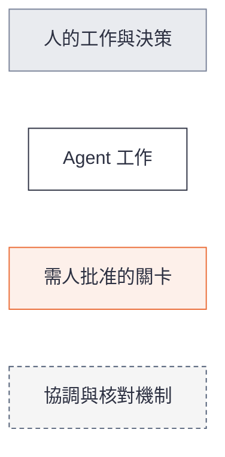
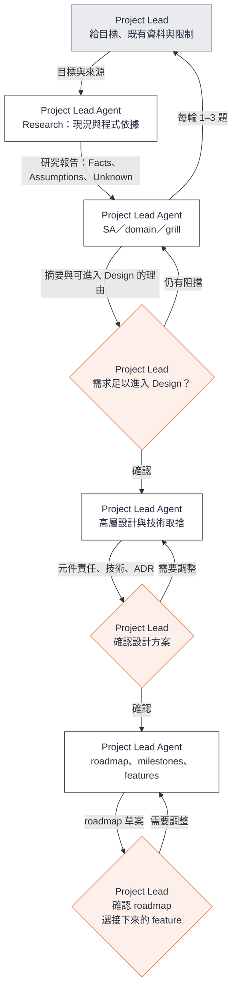
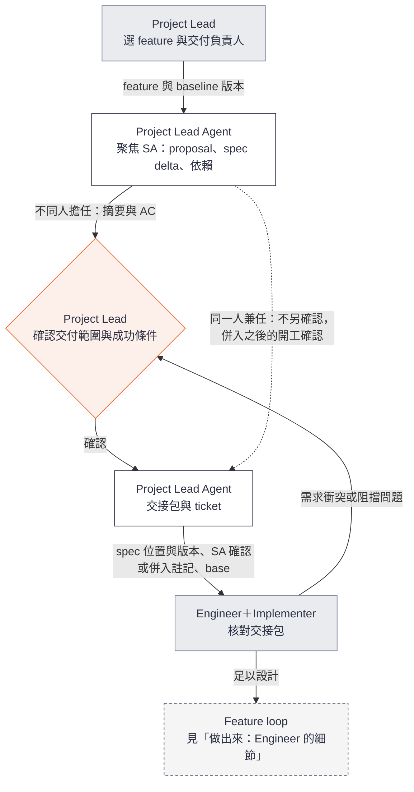
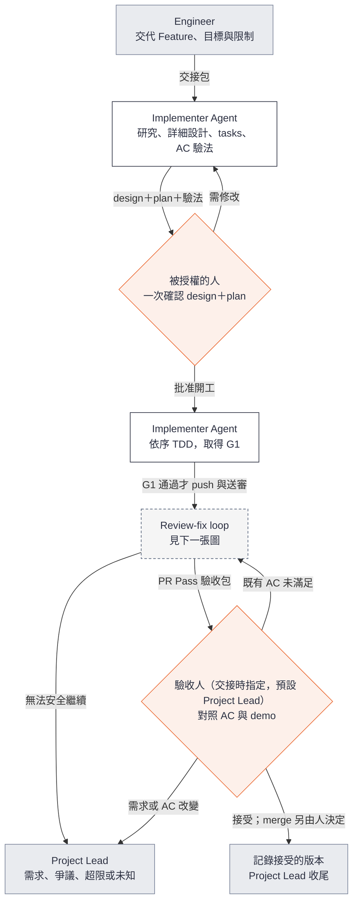
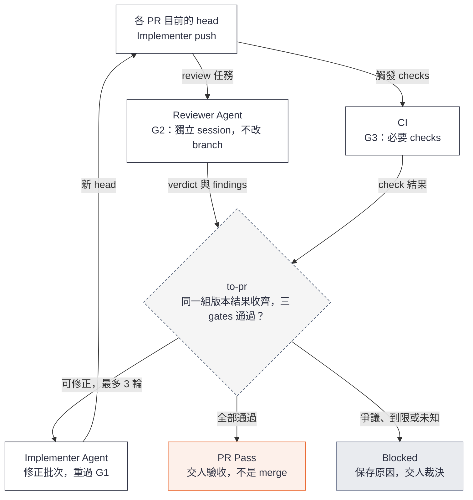

# Loop Engineering 參考手冊：每一步的細節

[使用指南](user-guide.md)照流程講每個活動；這裡放要查才看的細節，順序跟流程相同。以下各圖使用同一套顏色：



## 需求是怎麼問出來的

用於 A1 Project SA 與 A4 Feature SA。

Agent 不是想到什麼問什麼。它**先搭骨架，再由上往下問**：

1. **搭骨架**：骨架就是 SA 的七項（問題與目標、範圍、角色與情境、行為與規則、例外與限制、驗收、待決）。Agent 根據問題描述和研究先寫成草稿，每一格都標「假設」。
2. **由上往下確認**：從目標開始請你確認或修正；上一層定了，才問下一層。每個問題都對得回骨架的某一格。
3. **邊問邊寫**：你答完，Agent 就把那一格改成確認過的內容，寫進對應的文件。已經確認過的內容直接沿用，只核對適用性、追問差異。

以下是示意的例子，不是 cross-node-file-transfer 實際的問答紀錄。假設手上只有一段問題描述：「交易要用到前一站在別的 DC 產生的檔案，希望故障時交易不停擺。」

### Project SA：骨架到能力與 roadmap

```text
1. 問題與目標    某個 DC 故障時，其他 DC 的交易仍拿得到需要的檔案       （假設）
2. 範圍與不做    Ready 後的檔案不可修改；不支援跨部署範圍同步             （假設）
3. 角色與情境    App 發布檔案 → 送到需要它的 Node → 對方交易讀取 → 故障後補齊（假設）
4. 行為與規則    從情境的每一步拆出能力：發布、同步、讀取、對帳與恢復、運維（假設）
5. 例外與限制    不可靜默遺失；本地交易不被其他 Node 阻塞               （假設）
6. 驗收          milestone 的驗收方向，例如「發布後能在指定 Node 讀到」 （假設）
7. 待決          災難時容許的損失；DC 與 Node 的對應
```

由上往下問，每一層的答案決定下一層：

| 骨架 | Agent 問（附選項與建議） | 你的回答決定什麼 |
| --- | --- | --- |
| 1 目標 | 故障時要保證什麼：交易一定拿得到檔案，還是可以等待後重試？ | 系統的核心保證 |
| 2 範圍 | 第一版要不要支援檔案寫完後再修改？ | 「不做」清單 |
| 3 情境 | 端到端是這四步嗎？有沒有漏掉的角色或步驟？ | 能力要從哪些步驟拆 |
| 4 能力 | 每一步背後的能力這樣切，對嗎？ | roadmap 的分組與順序 |
| 5 限制 | 暫時故障一定要恢復；永久毀損要不要保證零損失？ | 每個 Feature 都要守的限制 |

「各 DC 自己持有副本，還是缺檔時向共用 DC 取」這類方案比較，等目標與限制確認後，在高層設計裡做。Project 層到這裡產出目標、範圍、情境、能力清單、共用限制與驗收方向，加上高層設計和 roadmap。**每個 Feature 的具體需求與 AC 這時還沒寫進 spec。**

### Feature SA：骨架到需求與 AC

排到「Finalize 協議」時，從 Project 情境裡「App 發布檔案」這一步搭這個 Feature 的骨架：

```text
1. 目標        App 寫完的檔案，什麼時候算可以交給同步              （假設）
2. 不做        掃描 ingest、跨 Node 同步（之後的 Feature）
3. 角色與流程  App：開始寫 → 寫入 → 宣告完成 → 看到結果          （假設）
4. 規則        宣告完成的方式；結果有哪幾種                        （假設）
5. 例外        宣告時 crash 或回應遺失；寫到一半放棄；太久沒動作   （假設）
6. 驗收        主流程與每個例外各一個可驗收的 Scenario
7. 待決        太久沒動作的時限
```

| 骨架 | Agent 問 | 產出 |
| --- | --- | --- |
| 4 規則 | 「宣告完成」要明確呼叫一個動作，還是 `close()` 就算？ | 需求：依回答寫下觸發方式，例如「必須明確呼叫 Finalize，`close()` 不算」 |
| 4 規則 | 宣告完成後，App 要能分辨哪些結果？ | 需求：例如成功、失敗、尚待確認三種結果 |
| 5 例外 | 宣告時 crash、回應遺失，App 重試會怎樣？ | Scenario：可查證是否已接受，重試不形成重複 |
| 5 例外 | 寫到一半放棄，或太久沒動作？ | 需求：放棄的動作，以及逾時後的清理與紀錄 |
| 6 驗收 | 這些 Scenario 夠不夠證明這個 Feature 可以用？ | AC 清單 |

Agent 把確認後的骨架寫成這個 Feature 的 proposal 與 spec（需求加上帶 ID 的 Scenario），交給你一頁摘要確認。

需求就這樣一個 Feature 接一個累積，每一條都追得到骨架的哪一格、當時的問答和你的原話。手上有現成需求文件（客戶規格、上游專案的 spec）時，它讓骨架草稿更完整：已確認的部分直接沿用，只核對是否適用這次的 Feature、追問差異。

### 開始與接續一次 SA

有三個時機會進入 SA：開新專案或匯入既有專案、選定要做的 feature、新證據推翻原本的需求。開一個 agent session，這樣說：

> /project-lead 做 project 的 SA。Repo 在〈路徑〉，既有資料在〈位置〉。我想解決的問題是〈一兩句〉。

某個 feature 的 SA 則用 `/feature-to-spec 準備〈feature〉`，見使用指南的 A4。

只要給四樣：哪一層、repo 在哪、既有資料、想解決什麼。第四樣講不清楚也沒關係，Agent 會先問。

進去之後：

1. **Agent 先研究，不先問問題**：用 research-codebase 查現況，交一份摘要，分清現況的 Facts、Assumptions 與 Unknown。
2. **每輪問你 1–3 題**：每題附為什麼現在要決定、選項、影響與建議。
3. **邊問邊寫**：每輪告訴你改了什麼、還剩哪些阻擋。
4. **提出「可進入 Design」**：附一頁摘要。
5. **你確認或退回**：Project SA 確認後進入高層設計（A2）；Feature SA 確認後交接（A4），由 Engineer 做詳細設計（B1）。這不是開工批准。你同時是 Engineer 時，Feature SA 的確認併入開工確認，spec、design、plan 一起看一次。

中途離開不影響進度，答案都已寫進文件。下次說「接續〈project／feature〉的 SA」，Agent 會先讀文件，已確認的不重問。

## 外圈產出哪些文件

用於 A1–A3。

以未來的 `cross-node-file-transfer` 演練為例：

> /project-lead 準備 cross-node-file-transfer。先核對參考資料裡可沿用的需求、領域、設計與 roadmap，保留來源版本；把參考規格依能力拆成需求輸入（不放進 `openspec/specs/`），先給我拆法對照表。只釐清差異與阻擋問題，最後交出 project intent、高層設計、roadmap 與第一個 feature 的建議。



Research 記錄「目前如何運作」，研究報告不是已批准的 spec。Spec 說「要達成什麼」，design 說「如何達成」。

外圈結束時，下面每個問題都要有文件可查；之後每個 Feature 引用這些文件的版本：

| 內容 | 位置 |
| --- | --- |
| 為誰解決什麼問題、哪些不做 | project intent 或 `mission.md` |
| 共用領域語言 | `CONTEXT.md` |
| 還沒實作的需求原文 | 需求輸入，記錄來源版本；匯入時依能力拆開 |
| 跨 feature 的共用限制 | 實作前在 project intent 列出並指向輸入；第一個讓它成立的 feature 把它帶進 spec |
| 已經做好的行為 | `openspec/specs/<能力>/spec.md`，只由「併入規格」（`openspec archive`）寫入，新專案開始時是空的 |
| 架構、技術棧與重要取捨 | 既有 system design、ADR 或 `tech.md` |
| Milestones、features、順序與完成條件 | roadmap |
| 如何 setup、build、test；工程規則與必要 CI | repository 指引、scripts、CI 設定 |

交接時保存採用的路徑與版本。已確認的需求可以沿用；新 example 的程式必須留下自己的驗證證據。需要先建立專案骨架（測試、CI、工程規則，常稱 Sprint 0 或 bootstrap）時，把它當作第一個 feature，和其他 feature 一樣用 ticket 編號。

完成這個階段，代表已有足以展開近期工作的 project intent、高層設計與 roadmap，不要求提前寫完所有未來 features 的 spec。

## Roadmap 要切多細

用於 A3。

Roadmap 只有兩層：milestone 和 feature。Feature 是能單獨驗收的交付，以一個 use case 或一個共用元件為單位，每個受影響的 repo 一個審得動的 PR；milestone 是幾個 feature 加上時間條件（目標日期）；task 寫在 feature 裡，不上 roadmap。

**垂直切**：每個 feature 交付一個看得到的行為，從使用者操作一路走到 UI／API、領域邏輯、資料與驗收測試，能單獨驗收。不要照技術層切（一個資料庫、一個後端、一個 API、一個前端）：那樣只製造整合依賴，每一片都無法單獨交付。水平的 feature 只用在多個 feature 共用的元件，例如 schema migration、共用 SDK／API、共用框架、測試基礎設施。好的切片＝一個看得到的行為＋最小的完整路徑＋清楚的驗收測試，做成一個 change、每個受影響 repo 一個 PR。Feature 裡的 task 另照 D71 切：預設垂直，整理和共用測試骨架先做（見[做出來：Engineer 的細節](#做出來engineer-的細節)）。

**切法是循環的**：先依 use case 或共用元件切 feature，再分組、加上目標日期成為 milestone；日期放不下就回頭拆小或延後。每個 feature 驗收後回到 A3 再看一次：design 發現某部分能單獨驗收就拆出去，依賴變了就調整順序。

Roadmap 會一直改，所以問題不是「切得越細越好」，而是哪些東西值得先寫：

- **Feature 清單很便宜**：只有名稱、一句範圍、依賴，以及對應需求輸入的哪幾條。當前 milestone 的切法有依據時，可以整個列出來，方便看平行和依賴。
- **Spec 等 feature 排進近期才寫**：建立這個 Feature 的 spec、做 SA。細節看穩定度，不看遠近；依賴程式現況的部分寫太早，會過時並誤導 Agent。
- **詳細設計等開工前才做**：由 Implementer 負責。

每個 feature 標「近期」或「暫定」，讓人分得出哪些已經要做。每個 feature 驗收後回頭看一次 roadmap；改範圍或順序時記進決策紀錄。

以 cross-node-file-transfer 為例：M1 的 feature 來自參考資料裡已經實作過的計畫，所以可以整個列出，只有專案骨架和第一個 feature 標近期；M2 要不要做等 M1 完成再決定，所以先列交付能力，排進近期前再切出 Feature。需求放在哪、怎麼流動，見[需求放在哪](#需求放在哪)；業界做法與出處見 [Roadmap 規劃參考](../references/roadmap-planning.md)。

## 工作層級：Milestone、Feature、Task

| 層級 | 是什麼 | 怎麼追蹤 | Azure DevOps |
| --- | --- | --- | --- |
| Milestone | 幾個 Feature 加上時間條件（目標日期），合起來是一個可以展示的成果 | roadmap；GitHub milestone | Feature 或 Epic |
| Feature | 一個自成一體、能單獨驗收的交付，以一個 use case 或一個共用元件為單位：一份 spec、每個受影響的 repo 一個 PR、一張 ticket | ticket | PBI（Story） |
| Task | 一個 session 做得完的工作，寫在 `tasks.md` | 不開 ticket | Task |

- Feature 的結果不一定要讓外部使用者看到，由系統其他部分或工程條件觀察也可以；重點是用自己的 AC 就能驗收，不必等之後的 Feature。業務上完整的能力由 Milestone 驗收。
- Feature 在每個受影響的 repo 各一個 PR，每個 PR 都要審得動。某部分能單獨驗收，或 PR 太大，就拆成另一個 Feature。
- 一個 task 一到幾個 commit，每個 commit 自己綠燈；PR、merge、併入規格都以 Feature 為單位。
- PR 不限行數，但要審得動：每個 task 做完審一次，最後 G2 再看整個 PR。

## 多個 repo 的專案

用於整個流程。每個產品一個 root repo 放規劃；只有一個 repo 的產品，root 就是它自己。

```text
<產品>-root/
├── openspec/             spec：現況，以及進行中的 Feature
├── docs/                 intent、roadmap、決策、設計
├── AGENTS.md、CLAUDE.md  共用的 agent 規則
├── repos.yaml            服務 repo 清單：名稱、URL、預設 branch、路徑、用途
└── repos/                同步指令依清單 clone 進來（root 不追蹤）
    ├── order-service/    各自的 origin、branch、PR、CI
    └── payment-service/
```

- 一個 Feature 可以跨 repo：一份 spec 放在 root，每個受影響的 repo 一個 PR（root 也算一個），都連到同一張 ticket。
- loop-engineering 是工具，不當產品的 root。

**清單** `repos.yaml` 放在 root，每個服務 repo 一筆：

```yaml
repos:
  - name: order-service
    url: git@github.com:acme/order-service.git
    branch: main
    path: repos/order-service
    purpose: 訂單 API
```

**同步指令**由專案提供（例如 `scripts/sync-repos`）：缺的 repo 就 clone，乾淨的就更新，有未提交修改的不動並回報。`repos/` 不進 root 的版控，也不用 git submodule。

**一個 Feature 跨 repo 時**

- spec、design、tasks 都在 root 的 `openspec/changes/<id>/`，寫在 root 的 branch `feature/<id>` 上；每個受影響的服務 repo 開同名 branch；每個 task 註明改哪個 repo。
- 每個受影響的 repo 開一個 PR（root 也算一個），都連到同一張 ticket並互相連結。
- G1、G3 在各 repo 執行；G2 對照 spec 審整組 PR；人驗收整個 Feature。
- merge 依依賴順序、提供方先；每個 PR 單獨 merge 都要安全（向後相容）。全部 merge 後才在 root 併入規格。
- 交接包與 PR Pass 驗收包列出每個受影響 repo 的 base branch、commit 與 PR；版本以這些 commit 為準。
- 其中能單獨驗收的部分，拆成另一個 Feature。

## 需求放在哪

用於 A4、B1–B4、A5。**需求放在哪，看它做到哪了。**

```text
還沒開始做            決定做、正在做               做完了
OpenSpec 之外     →   openspec/changes/<名稱>/  →  openspec/specs/
（輸入、roadmap）      在 feature/<名稱> branch     merge 進 main 後
                      寫 spec、design、實作        併入規格時搬進來
```

### 跟著一條需求走

以 cross-node-file-transfer 的需求 FR-02「Source Ready & Acceptance Boundary」（來源檔案什麼時候才算 Ready）為例：

1. **一開始**：它在需求輸入裡。roadmap 上只有一行：M1 的 Feature「Finalize 協議」，也就是示範專案 GitHub 上的 ticket #2。
2. **排到要做**：建立這個 Feature 的 spec，位置例如 `openspec/changes/finalize-protocol/`。Project Lead Agent 把 FR-02 中這次要做的部分寫成 spec（內容寫完並持久化才回報 Ready），人確認。Crash 後重新發現檔案的部分屬於之後的「掃描 ingest」，到時用 MODIFIED 補上。
3. **實作**：Engineer 帶 Implementer 寫 design 和 tasks，一個 task 一個 task 做，最後開 PR。
4. **做完**：人驗收、merge 之後併入規格（archive），FR-02 這次做完的部分搬進 `openspec/specs/file-readiness/spec.md`，從此代表「系統已經做得到」。重新發現的部分，等掃描 ingest 做完再用 MODIFIED 補進去。

所以 Agent 讀到 `openspec/specs/`，就知道系統現在做得到什麼；讀到 `openspec/changes/`，就知道接下來要做什麼。

### OpenSpec 的資料夾

```text
openspec/
├── specs/                   ← 系統現在做得到的事（做完的需求，只由併入規格寫入）
└── changes/
    ├── finalize-protocol/   ← 一個 Feature 的資料夾，進行中
    │   ├── proposal.md      ←   為什麼做、做什麼、不做什麼
    │   ├── specs/           ←   這次受影響的需求：新增、修改（寫完整新版）或移除
    │   ├── design.md        ←   怎麼做
    │   └── tasks.md         ←   分幾步做
    └── archive/             ← 做完的 Feature 資料夾；差異已經併回最上面的 specs/
```

OpenSpec 把 `changes/` 底下每個 Feature 的資料夾叫 change，和上線部署的變更無關。不改名，因為資料夾名稱是 OpenSpec 寫死的，改了工具就找不到。

### 常見問題

- **SA 會一次寫出全部需求嗎？** 不會。Project SA 問出目標、範圍、端到端情境、能力清單、關鍵規則、共用限制與 Milestone 的驗收方向，再排出 roadmap，但還不寫各 Feature 的具體需求與 AC；每個 Feature 的需求與 AC，在它排進近期、做 Feature SA 時才經研究與逐輪問答（每輪 1–3 題）寫出來。每一步問什麼、產出什麼，見[需求是怎麼問出來的](#需求是怎麼問出來的)。有現成需求文件時，它只是參考輸入，不會直接變成 spec。
- **roadmap 上還沒開始的 Feature 在哪？** 不在 OpenSpec 裡。roadmap 上一行：名稱、目標、所屬 Milestone、依賴，以及對應輸入裡的哪幾條需求。
- **為什麼不把整份需求先放進 `openspec/specs/`？** OpenSpec 定義它是現況："Specs ... describe how your system currently behaves"（[concepts](https://github.com/Fission-AI/OpenSpec/blob/main/docs/concepts.md)）。放進還沒做的需求，Agent 會以為它已經存在。
- **跨 Feature 的共用限制呢？**（容量、安全、資料不遺失）還沒實作前，project intent 列出它們並指向輸入。第一個讓它成立的 Feature 把它帶進自己的 spec；Feature SA 每次都要檢查這次碰到的行為有沒有相關限制。
- **spec 要先寫多細？** 看穩不穩定，不看遠近。穩定的需求可以先在輸入裡寫細；依賴程式現況的部分（這次的 spec 細節、design、tasks）到要做時才寫，過時的規格會誤導 Agent。
- **修 bug 也要建立 Feature 的 spec 嗎？** 不用。讓行為回到既有 spec 的修正、更新依賴、補測試，都不改需求，ticket 本身就是規格：內容自足、附 AC、範圍小。Bug 暴露出 spec 沒寫到的情況時，才建立 Feature 的 spec 補上。

### 每一步誰做、ticket 在什麼狀態

| 步驟 | 誰 | 產出 | Ticket |
| --- | --- | --- | --- |
| 1. 排進 roadmap | Project Lead Agent 提出，Project Lead 確認 | roadmap 上一行 | 通常還沒開；想早點讓人看到可以先開，只寫目標 |
| 2. 選中 | Project Lead 在確認 roadmap 時選；Project Lead Agent 開 branch 與 change | `feature/<id>`、`openspec new change <id>` | 開 ticket，或把已有的 ticket 改成薄格式：準備中 |
| 3. Feature SA | Project Lead Agent 研究與提問，Project Lead 或 Engineer 回答 | `proposal.md`、spec；`openspec validate <id>` 通過 | 準備中 |
| 4. SA 確認、交接 | Project Lead 確認；Project Lead Agent 用 feature-to-spec 組交接包 | 確認紀錄、交接包 | 就緒（可設計）；列出 AC |
| 5. Design＋plan | Implementer | `design.md`、`tasks.md`、AC 的驗法 | |
| 6. 開工確認 | 交接時指定的人，通常是 Engineer | 確認紀錄 | 開發中 |
| 7. 逐 task 實作 | Implementer；Reviewer 做局部 review | 每個 task 一到幾個綠燈 commit | |
| 8. PR | Implementer、Reviewer、CI | 三個 gates、PR Pass 驗收包 | 待驗收；Spec 改連 root PR |
| 9. 驗收、merge | 驗收人（預設 Project Lead） | 接受紀錄；由人 merge | 已接受；勾選確認過的 AC |
| 10. 收尾 | Project Lead Agent | `openspec archive`；更新 roadmap；Retro 候選 | 已完成；補 `changes/archive/` 的連結；由人關閉。Agent 寫 ticket 都要授權 |

兩個角色由同一人擔任時，只有第 4 步的 spec 確認延到第 6 步，和 design、plan 一起看一次，確認後開工；交接、列出 AC、標「就緒」仍在第 4 步完成。不同人擔任時分開，spec 被推翻時 Engineer 不會白做。

## Spec 怎麼寫、放哪

用於 A4。

SA 要回答七個問題，它們是檢核表，不是七個章節：問題與目標、範圍與非範圍、角色與端到端情境、行為與業務規則、例外與必要限制、驗收條件、假設依賴與待決。Agent 把它們放進四個位置：

| 位置 | 裝什麼 |
| --- | --- |
| `proposal.md` 的 Why | 問題與目標 |
| `proposal.md` 的 What Changes 與「不做」 | 範圍與非範圍 |
| `specs/<能力>/spec.md` 的 Requirement 與 Scenario | 情境、行為與規則、例外與限制、驗收條件；每個 Scenario 就是一條帶 ID 的 AC |
| `proposal.md` 的待決與依賴 | 假設、依賴與待決 |

你確認時看到的是這樣的摘要：

```text
目標：……                          → proposal.md#why
不做：……                          → proposal.md
規則：ING-01 ……、ING-02 ……        → specs/file-ingest/spec.md
例外：AC-I03 重複寫入、AC-I04 逾時
待決：Q1 容量上限（阻擋 Design，等你決定）
版本：<commit 或檔案 hash>
```

需求 ID 每個能力一個前綴，用過不重用，併入規格後也不變，讓 review 與證據能一直追溯。格式由 `openspec validate` 檢查；內容對不對由你和 Reviewer 判斷。

## 交接

用於 A4、B3、B4。兩層之間只交兩樣東西，Agent 依規則組好，你讀的是它們的重點：

| 介面 | 方向 | 你要確認什麼 |
| --- | --- | --- |
| **交接包** | Project Lead → Engineer（feature loop） | spec 的版本寫明，並附上 SA 確認紀錄；兼任 Engineer 時，改附「併入開工確認」的註記；每個受影響 repo 的起點寫清楚；依賴的上游寫明版本與狀態（上游接受並 merge 之前可以設計，不能開始實作）；待決事項各有決策者；寫明誰批准開工、誰驗收。它不含開工確認：design＋plan 在 loop 裡產出後才由人確認 |
| **PR Pass 驗收包** | feature loop → 驗收人，副本給 Project Lead | 每條 AC 都有結果與證據；證據對應的是目前的版本；風險與已知限制寫明；PR、CI、review 都連得到 |

兩者的完整欄位定義在[交接契約](../workflow/contracts.md#角色交接摘要)，由 Agent 照著組。

feature loop 無法安全繼續時，改交 **Blocked**：run ID、問題、已嘗試事項、證據、可選方案與需要誰決定。

**PR Pass 不是接受，接受也不是 merge**，三者分開記錄。有依賴的 Feature 要等上游被接受並 merge 後才開始實作；以未合併 PR 為 base 的 stacked PR 還沒決定是否允許。

### 控制方向與自主程度

Project 層是人和 Agent 一來一回的對話，不需要派工或 gates；Feature 層有多個 Agent 並行，需要 controller 核對證據。所以控制只往下走：project-lead 排 roadmap、選 Feature；feature-to-spec 把選中的 Feature 寫成 spec，交接包交給內圈；內圈依序是 spec-to-plan、plan-to-code、to-pr，從不回頭呼叫前面的 skill。orchestrate 可用後把內圈三個 skill 串起來。同一套 skill 有兩種自主程度：

| 模式 | 誰啟動每個 Feature | 適合 |
| --- | --- | --- |
| 手動 | 人拿交接包，在 feature 的 worktree 依序啟動 spec-to-plan、plan-to-code、to-pr，每個停下後再啟動下一個 | 第一版、個人使用 |
| 授權 | Project Lead Agent 在 Project Lead 核准的範圍內啟動；各 Feature 的 SA 確認須先完成，或註明併入開工確認。loop 產出 design＋plan 後停下，等人確認開工，Project Lead Agent 不能代批 | goal 模式、多 Feature 的 demo |


### 把 Feature 交出去

> /feature-to-spec 準備〈feature〉：補足 spec、AC、必要高層設計與依賴，引用 project intent、高層設計與 roadmap 的版本。交接給〈Engineer〉，列出已確認事項與阻擋問題。



交接包的內容見上表。Ticket 連到 spec，不重貼內容。Project Lead Agent 可以附 tasks 草案，但最終 plan 由 Implementer 校準。

**交接完成**是 Engineer 知道要交付什麼、能開始詳細設計；不等於已開工。啟動 feature loop 有兩種方式：

- **手動**：你把交接包交給 Engineer，由他啟動。
- **授權**：你明確授權 Project Lead Agent 負責某個範圍，且該 feature 的 SA 已確認（或註明併入開工確認），Project Lead Agent 就能自己啟動。loop 產出 design＋plan 後會停下等交接時指定的人確認開工，Project Lead Agent 不能代批。

### 跨人、跨 session 要交什麼

換人或重開 session 時，交文件位置與適用版本，再讀保存的結果。聊天可補背景，但不承擔唯一的進度與需求記憶。Implementer 與 Reviewer 不直接互傳結果，都經由保存的檔案交接：局部結果由 plan-to-code 保存，gates 由 to-pr 執行（orchestrate 可用後由它串接）；先保存結果，再發布或通知，通知只是喚醒接收者。各角色之間的交接內容見[交接契約](../workflow/contracts.md#角色交接摘要)。

## 做出來：Engineer 的細節

用於 B1–B3。

### 你會收到什麼

Project Lead 交給你一個交接包，內容見[交接](#交接)。缺東西或有衝突時，先回報 Project Lead，不要自己補需求。

feature loop 從收到交接包就開始，第一步是 design＋plan，然後停下等開工確認。交接包本身不含開工確認。

你和 Implementer 只改這個 Feature 的 `design.md`、`tasks.md` 與 AC 驗法；驗法寫在 validation 文件，或 `tasks.md` 的明確段落。`proposal.md` 與 `specs/` 屬於 A4，由 Project Lead 確認；需要改需求或 AC 時回到 A4，用 `feature-to-spec` 修改這個既有的 Feature，不在程式裡繞過。

### 完成一個 Feature，包括 PR

先看主線：人只在開工確認與驗收兩處介入，中間由 agents 跑 review-fix loop。



再看 review-fix loop：G2 與 G3 對同一組版本並行，收齊後才判定。多 repo 的 Feature 每個 repo 各有一個 PR：G3 逐 repo 跑在各 PR 目前的 head；G2 對整組 PR 的目前版本審一次；任一 PR 有新 push，整組的 G2 與 PR Pass 都要重評。



G1 缺原始證據、必要結果無法取得或出現未知執行狀態時，先保存原因並交人處理，不為了走到 PR Pass 補造證據。Implementer 對 finding 有異議時，反證先交獨立 Reviewer 覆核一次，仍有 blocking 爭議才交人。

你負責確認技術交付安排、查看進度、處理自己有權決定的問題；Agent 負責實際工作。若你被授權批准 design＋plan，由你完成開工確認，否則交指定決策者。正常已授權工作不需要每個 task 都回來簽核。

Task 是 PR 內的工作單位，一個 session 做得完，不開 ticket。一個可獨立驗收的 Feature，在每個受影響的 repo 各對應一個 PR；做 design 時發現某部分能單獨驗收，或某個 repo 的 PR 大到審不動，就提議拆成另一個 Feature，由 Project Lead 確認。每個 task 一到幾個綠燈 commit，完成後由獨立 Reviewer 做一次局部 review，最後 G2 再看整個 PR。

### 計畫要讓 TDD 有真的 Red

計畫不放實作碼，但每個 task 要列出要寫的測試，寫明 **Red 應該失敗在哪個斷言**；好幾個 task 共用的 fixture、setup、指令入口或 stub，排成第一個 task 先做。只寫範圍、介面和驗證命令的精簡計畫，會讓 Implementer 自己決定測試怎麼寫：薄 controller 第一片的 8 個 task，第一次 review 全部要求修改，其中 6 個被指出 Red 停在共用 setup、缺的指令或回傳 `not_implemented` 的 stub，根本沒走到要測的行為。那樣的 Red 證明不了測試在檢查行為，只能靠之後的 review 抓，換來多輪返工。

### 模型怎麼選

預設兩段都用強模型，plan 寫到設計層，給人審；便宜模型只用在兩種情況：五個前提都成立的 task，以及有測試保護的機械性工作（D72）。

「強 planner＋便宜 coder」的前提是：難在想清楚，寫出來只是翻譯。它靠五個前提：

| 前提 | 不成立會怎樣 |
| --- | --- |
| 想比寫難 | 邊寫才發現問題，coder 得自己判斷，便宜模型容易做錯 |
| 任務切得開 | 改一處牽動多處，coder 看不到全貌 |
| 有自動檢查（測試、編譯器、linter） | 錯了沒人發現，省下的錢之後要還 |
| 寫的量遠大於想的量 | 任務很小時，分兩個模型反而麻煩 |
| 常見寫法 | 冷門技術或自家規則，便宜模型只能猜 |

所以每個 task 在 `tasks.md` 標一種模式，◆確認開工時人可以調整：

| 情況 | Plan 寫到哪 | Implementer |
| --- | --- | --- |
| 預設 | 設計層、介面與不變式、要證明的測試 | 強模型 |
| 五個前提都成立 | 再加改動點：哪個檔、哪個函式、簽名、特殊狀況、要跑的測試；不寫逐行實作 | 可以用便宜模型 |
| legacy，或領域規則藏在程式碼裡（例如 SECS/GEM、CORBA、VB） | 設計層；強模型先實際讀 code | 強模型；要改的地方沒有測試保護時，第一個 task 先補特性測試（實際執行程式記下現有行為，不靠推測） |
| 有測試保護的機械性工作（改名、補樣板、分批遷移） | 不需要 | 便宜模型單做 |

Reviewer 不論哪種模式都用強模型，而且和 Implementer 是不同的模型，最好是另一家的（D52）。

Engineer 也可以替某個 task 多要一層程式碼層級的計畫，例如 legacy 上 PBI 大小的 task：`spec-to-plan` 用 Superpowers `writing-plans` 寫進 change 的 `task-plans/<task>.md`，沒有測試保護時從特性測試開始；`tasks.md` 仍是唯一的權威，計畫審查一併審它。差別只在多這一層規劃，切法、逐 task 審查與 `to-pr` 都不變。在 legacy 上，省錢的關鍵不是換便宜的 coder，而是先補測試：測試補起來之後，才有越來越多工作可以安全地交給便宜模型。

A/B/C 重跑的 C 組（Superpowers 原版：Opus 寫到接近逐行的計畫、Sonnet 實作）是第一個資料點：T2.2 一次通過收件，獨立審查仍找到 2 個 major，Claude 部分約 19.6 美元。這是新 code，只有一題，還不足以改動預設。

### 為什麼計畫不寫程式碼

`tasks.md` 的測試清單就是給 Implementer 的詳細計畫：它寫死要證明什麼（從入口看得到的行為與斷言），怎麼寫程式留給 Implementer（D68、D71）。

- **Matt Pocock 的做法也是這樣**：`to-tickets` 切好之後，由 `/implement` 驅動 `/tdd`，一次做一個 red-green 循環，中間沒有程式碼層級的計畫。他的 `tdd` 還明確反對先把測試全部寫好，理由是：這樣測的是想像出來的行為，而且還沒理解實作，就先把測試的結構定死了。所以計畫只列行為與斷言，不寫測試碼；Implementer 一次寫一個，可以調整組織方式，不改驗證的行為。
- **Superpowers 原版會把程式碼寫進計畫**，由 planner 寫。A/B/C 重跑時，C 組照原版寫的 T2.2 計畫有 2184 行、約 70 段程式碼，比這個 task 的程式加測試還長。這樣做有兩個代價：
  - Implementer 多半照抄，Red 很容易只是「函式不存在」這種假 Red；
  - planner 的錯誤會直接傳到程式碼裡。

取捨：不事先寫程式碼，Implementer 就要自己判斷實作方式，品質靠三道把關撐住，少一道就不可靠：

1. `tasks.md` 的測試寫得夠精確；
2. 收件時嚴格檢查每個 Red 是不是打到要測的斷言；
3. 另一家模型做 per-task review。

B 組重跑 T2.2 時，第 2 道放寬了：18 個 Red 有 14 個停在指令分派，要靠第 3 道的 review 才抓到，多了一輪修正。

### 計畫要讓 AC 真正能驗證

每個 AC 都要有「怎麼驗、在哪裡驗、何謂通過、證據放哪」。以下只是寫法示例，並非已核准的 cross-node 功能需求：

| AC 示例 | 驗證方法／環境 | 通過標準 | 保存的證據 |
| --- | --- | --- | --- |
| 成功傳送後，目的檔案內容與來源一致 | 對採用的兩節點測試環境執行傳送，再獨立比對檔案 | 傳送成功且內容完全相符 | 測試輸出、環境資訊、適用程式版本 |
| 傳送失敗時，呼叫端不會收到成功結果 | 在受控環境製造傳送失敗，檢查公開回傳行為 | 明確回報失敗，不誤報成功 | 行為測試結果及原始 Red→Green 紀錄 |

### PR Pass 到底代表什麼

| Gate | 足以通過的證據 |
| --- | --- |
| G1：實作／TDD | 與本次行為及 task 可追溯的 Red→Green 過程，最終相關與回歸驗證適用目前整合後的 head |
| G2：獨立 Review | Reviewer 已對照 spec、design、完整 PR diff 與必要 context；未解 blocking findings 為零 |
| G3：CI | 設定要求的 checks 全部取得可接受的成功結果，且適用目前版本 |

G1 先於送審；G2 與 G3 彼此獨立，可以並行。Red 通常來自較早版本，不要求與最後 Green 同 SHA。CI 綠燈不能補上缺失的 TDD 證據，agent 的「完成」也不能當作 gate 結果。純文件或註解的 TDD N/A 須有理由與檢查，並由獨立 Reviewer 確認。

新 push、review base 或適用 spec／design 改變時，重新評估證據；過期結果不能放行。缺 check、pending、取消或未知都不算成功。

**PR Pass 表示可交給人驗收。** 不代表已被接受、已合併或已部署。人發現原需求未滿足，回修正；若是新增需求或改變 AC，先回 Project Lead 更新並確認需求，不能為了讓程式過關而反改 spec。

### 讓單一 Feature 持續跑

一個可執行的 goal 包含：交付範圍、何謂完成、允許的動作、執行限制，以及需要你回來的情況。

> 請推進〈Feature〉，以已確認的 design／plan 為準。可依計畫實作、更新 PR、執行獨立 review／CI 及修正循環。直到目前版本的三 gates 通過，整理驗收包後停下。保留 worktree，不自動 merge、close issue 或 deploy。需求／AC 或設計需改變時回來裁決；最多三輪修正、四小時主動執行時間。

to-pr 按授權工作，核對每個 gate 的證據都對應目前版本；orchestrate 與 controller 可用後，改由它們串接與核對。每個基礎設施操作最多額外重試兩次，和三輪程式修正分開計算；未知的執行結果先保存並停止，不反覆重派。

查進度時，你應看得到：目前 feature／PR 與版本、哪個角色正在工作、各 gate 的證據或缺口、下一步，以及是否有需要人的問題。

轉為 **Blocked** 時，agent 應交出問題、已嘗試事項、證據、可選方案與需要你決定的事。你補上決策後，再從保存的狀態核對並接續；不能只憑一句「proceed」忽略尚未解決的正確性問題。

### 你交回什麼

| 結果 | 交給誰 |
| --- | --- |
| PR Pass 驗收包（內容見[交接](#交接)） | 驗收人，副本給 Project Lead |
| Blocked：需求或 scope | Project Lead |
| Blocked：環境、權限、爭議或到限 | 有權裁決的人 |

驗收後的 Retro 與下一個 feature，以及 merge 後的併入規格，都由 Project Lead 和 Project Lead Agent 處理。依賴與 stacked PR 的規則見[交接](#交接)。

## 驗收之後：收尾

用於 B4、A5。

feature loop 回來的結果只有兩種：

- **PR Pass 驗收包**：交給驗收人（預設是 Project Lead）；內容見[交接](#交接)。
- **Blocked**：如果原因是需求或 scope，Project Lead 和 Project Lead Agent 分析影響並記錄決策，再用 `feature-to-spec` 修改 spec、交出新的交接包。

驗收人接受之後，Project Lead Agent 會：

1. **整理 Retro 候選**：只挑 1–3 個有證據的改善，寫明來源、原因、改善、owner 與驗法。沒有證據就不寫。
2. **提出下一個 feature**：更新 roadmap、檢查依賴，讓 Project Lead 在確認 roadmap 時選。

確認 PR 已 merge 之後，再：

3. **併入規格**（`openspec archive`）：把這個 Feature 的需求差異併回 `openspec/specs/`，從此代表「系統已經做得到」。

有依賴的 feature 等上游接受並 merge 後才開始實作；等待期間可以先準備它的 spec。Milestone 還需要自己的跨 feature 整合驗證，不能把一串 PR 綠燈直接加總成完成。

## 給一個 goal，推進多個 Feature

現在能做的：把 goal 拆成多個 Feature，沒有依賴的同時進行，有依賴的照順序推進；有依賴的 Feature 等上游接受並 merge 後才開始實作。Stacked PR（下游以還沒合併的上游 PR 為 base）還沒決定、也還沒實作，它的目標情境記在[設計文件](../workflow/stacked-pr.md)。

## 查進度

你問進度時，Project Lead Agent 應列出 roadmap 上每個 feature 的狀態：準備中、SA 已確認、feature loop 進行中（附 run ID）、PR Pass、已接受、已 merge 並併入規格，或 Blocked 與原因。狀態來自文件、ticket、PR 與 controller 的唯讀狀態，不靠對話記憶。這個專案進度視圖的自動化列在 S2。

## 演練路線：用 cross-node-file-transfer 跟走一遍

這是後續演練路線，Feature 名稱與切法以示範專案確認的 roadmap 為準，本指南不另立產品 spec。示範專案分成 root repo `cross-node-root`（規劃、spec、ticket）與程式 repo `cross-node-file-transfer`（由 `repos.yaml` 拉進 `repos/`）。

1. **定方向、排順序（A1–A3）**：Project Lead Agent 把參考規格依能力拆開，當作需求輸入並記錄來源版本，不放進 `openspec/specs/`；再整理 domain、設計、共用限制與 roadmap。Project Lead 確認拆法與適用性。
2. **專案骨架（第一個 Feature）**：repo 骨架、CI 與工程規則。它沒有產品行為，但「乾淨 clone 能建置測試、PR 有必要 checks」可以單獨驗收，寫成工程能力（例如 `engineering-baseline`）的 spec，常稱 Sprint 0 或 bootstrap。在 orchestrate 可用前可以手動協調，歷程標明「人工協調」，再由人驗收。
3. **交付第一個產品 Feature（A4、B1–B3）**：Project Lead Agent 準備 spec 與交接包，Project Lead 確認，Engineer 帶 Implementer 完成 PR；另一個 session 的 Reviewer 審查。
4. **驗證修正循環**：有真實 blocking finding 時，留下 finding → fix → re-review 的歷程。review 沒找到問題就如實記錄，不製造缺陷湊演示。
5. **驗收與收尾（B4、A5）**：驗收人接受後，Project Lead Agent 整理 Retro 候選、提出接下來的 Feature；確認 merge 後再併入規格。
6. **接續下一個 Feature**：核對依賴、人工接受、merge，以及下一個 Feature 引用的文件版本；保存各 Feature 的 branch／worktree、文件與交付證據。
7. **展示 Milestone（C）**：執行跨 Feature 的整合情境。真正的 stacked PR 展示，要等 stacked PR 的規則決定、能力驗證之後再加入。

Demo 結束時，觀眾應能沿一條路徑找到：「目標 → Milestone → Feature／AC → design／tasks → worktree／PR → TDD／review／CI → 人的決策 → 併入規格後的 spec」。

## OpenSpec 和 Superpowers 怎麼分工

用於 A4、B1–B3、A5。**OpenSpec 管文件：放哪、長什麼樣、什麼時候變成現況；Superpowers 管做事的紀律。** 每種文件只有 OpenSpec 那一份，Superpowers 只借它的做法。

| 步驟 | 文件（OpenSpec） | 怎麼寫、怎麼做 |
| --- | --- | --- |
| A4 Specify | `proposal.md`、`specs/<能力>/spec.md` | feature-to-spec：由上往下問（Matt Pocock 的 grilling） |
| B1 Design | `design.md` | 在 A2 的邊界內決定；方案要比較時，借 Superpowers brainstorming 的做法 |
| B1 Plan | `tasks.md` | 切法照 Matt Pocock `to-tickets` 的垂直切片（D71）；每個 task 列測試與預期的 Red，不放實作碼（D68） |
| B2 Build | 程式與測試；勾 `tasks.md` | Superpowers test-driven-development；要分派多個 Agent 時用 subagent-driven-development |
| B3 Verify | PR、ticket 留言 | 另一個模型的獨立 Reviewer |
| A5 Retro | `openspec archive` → `openspec/specs/` | OpenSpec |

- **OpenSpec 的好處**：需求只有一份、每條有 ID；`openspec validate` 檢查格式；進行中的在 `changes/`，併入規格後才進 `specs/`，Agent 不會把還沒做的當成已經有。
- **Superpowers 的好處**：計畫拆多細、測試先寫、Red 一定先紅這些紀律；OpenSpec 只給格式，不管這些。
- **不要讓 Superpowers 另寫一份**：brainstorming 預設寫 `docs/superpowers/specs/…`、writing-plans 預設寫 `docs/superpowers/plans/…`。照預設走，同一個 Feature 會有兩份 spec 或兩份計畫，遲早對不上。用它們時要求內容寫進上表的 OpenSpec 檔案。

## 會用哪些 skills 與工具

在 loop-engineering 執行 `./setup.sh`，就會把下表的 skills 裝到 `~/.claude/skills`、`~/.agents/skills`、`~/.codex/skills`，並檢查 OpenSpec CLI 的版本。無法這樣安裝時，用 `./setup.sh --project <root repo>` 把它們複製進產品 root repo 的 `.claude/skills/` 與 `.agents/skills/`，由 root repo commit；從 root 開 session 就讀得到，OpenSpec 的 skills 則由 root 的 `openspec init --tools claude,codex` 產生。外部 skills 的來源與版本見 [SOURCES.md](../../skills/third-party/SOURCES.md)。這些 skills 在哪一層，見使用指南的[人、Agent 與工具的分層](user-guide.md#人agent-與工具的分層)。

| 用途 | 用什麼 |
| --- | --- |
| Project 層：目的與需求、設計方案、roadmap、收尾 | skill [project-lead](../../skills/project-lead/SKILL.md)（草稿） |
| 準備一個 Feature：change、spec、ticket、交接包 | skill [feature-to-spec](../../skills/feature-to-spec/SKILL.md)（草稿）；和 project-lead 共用 [SA 問法](../../skills/project-lead/sa-method.md) |
| 研究現況 | skill [research-codebase](../../skills/research-codebase/SKILL.md)，改寫自 HumanLayer；只記錄現況，不批准需求或決定設計 |
| 看懂大的 codebase | skill graphify（[Graphify-Labs/graphify](https://github.com/Graphify-Labs/graphify)，Apache-2.0）：把程式與文件建成知識圖，產出在 `graphify-out/`。不在 `setup.sh` 裡，另外安裝：`uv tool install graphifyy==0.9.71`，再執行 `graphify install`（Codex 加 `--platform codex`）；安裝程式若建立了 `~/.claude/CLAUDE.md`，看過內容再決定要不要留 |
| SA 問答、領域語言 | skill [grilling](../../skills/third-party/mattpocock/productivity/grilling/SKILL.md)、[domain-modeling](../../skills/third-party/mattpocock/engineering/domain-modeling/SKILL.md)（Matt Pocock），由 project-lead、feature-to-spec 按需叫用（例如只追問一條不確定的 AC）；需求模糊或 Project 層談方向時，由人輸入 [grill-me](../../skills/third-party/mattpocock/productivity/grill-me/SKILL.md) 或 [grill-with-docs](../../skills/third-party/mattpocock/engineering/grill-with-docs/SKILL.md)（兩者只能由人啟動；後者同時寫 ADR 與詞彙表）；從已確認需求切出的 Feature，SA 方法的節制問法就夠 |
| 規格 | OpenSpec CLI 1.13.1（[指令說明](https://github.com/Fission-AI/OpenSpec/blob/main/docs/cli.md)）；它的 skills 由 `openspec init` 產生 |
| 單一 Feature 的內圈 | skill [spec-to-plan](../../skills/spec-to-plan/SKILL.md)（B1）、skill [plan-to-code](../../skills/plan-to-code/SKILL.md)（B2）、skill [to-pr](../../skills/to-pr/SKILL.md)（B3）：B1 停在 ◆確認開工，B2 做完直接接 B3，B3 停在 PR Pass 等 ◆驗收（D69）；之後由 skill orchestrate 串起來並呼叫薄 controller，第一片實作中 |
| TDD | skill [test-driven-development](../../skills/third-party/superpowers/test-driven-development/SKILL.md)（Superpowers）；每個行為 task 保存可追溯證據 |
| 審查與修正 | 獨立 Reviewer（另一個模型、新 session），依 spec 與工程規則審查；Implementer 修正 |
| Example 執行環境 | Herdr 管 sessions 與工作區；本機 OpenAI 經 OpenCode，Claude 直接用 Claude Code；Orca 是選配入口 |
| 程式與協作紀錄 | Git branches／worktrees、GitHub issues／PRs／CI，以及可讀的執行結果與狀態 |

loop-engineering 自己開發 controller 時，預設 Opus 5.5 實作、GPT 審查；Reviewer 必須使用不同的實際模型與獨立 session。其他專案的 profile 仍需明確設定及驗證。

## 想知道為什麼

本手冊只說怎麼做。規則本身、設計理由與取捨在內部設計文件：[決策紀錄](../decisions.md)、[交接契約](../workflow/contracts.md)、[流程設計](../workflow/overview.md)、[SA 階段契約](../workflow/project-lead-sa.md)；追實作讀[最新 handoff](../handoffs/2026-09-27-controller-design.md)。手冊和它們有出入時，以設計文件為準。

| 主題 | 依據 |
| --- | --- |
| 兩個 skill、控制只往下走 | D55 |
| spec 放在 OpenSpec；需求依狀態放置 | D54、D58 |
| 工作三層、Feature 的定義、每個 task 局部 review、小工作 | D57 |
| 角色是工作；兼任時 SA 確認併入開工確認 | D59 |
| 手動階段的交付紀錄放 ticket 留言 | D60 |
| 多 repo 的 root 結構與跨 repo 的 Feature | D61 |
| 驗收人預設是誰 | D62 |
| 外圈三步各有一次確認；在確認 roadmap 時選接下來的 Feature，沒有依賴的可以並行 | D63、D27 |
| Feature 以 use case 或共用元件為單位；Milestone 加上時間；切法是循環的 | D65 |
| Feature spec 屬於外圈；內圈是 Implement → Validate | D64 |
| 準備 Feature 的 skill 獨立成 feature-to-spec | D66 |
| 內圈的三個 skill 與依複雜度決定 effort | D69 |
| 修正額度：三輪與到限後的追加 | D13、D70 |
| Roadmap 上的 Feature 怎麼切 | D74、D65 |
| Feature 怎麼切成 tasks | D71、D68 |
| 模型與 plan 細度 | D72、D69 |
| 每個 Feature 一條 feature branch；薄 ticket 的格式 | D67 |
| 計畫列出測試與預期的 Red；共用測試骨架先做；Superpowers 的方法寫進 OpenSpec 的檔案 | D68 |
| 有依賴的 Feature 等上游接受並 merge | D27 |
| 示範專案的 Project 層先行 | D56 |
| 薄 controller 第一片的核准 | D53 |
